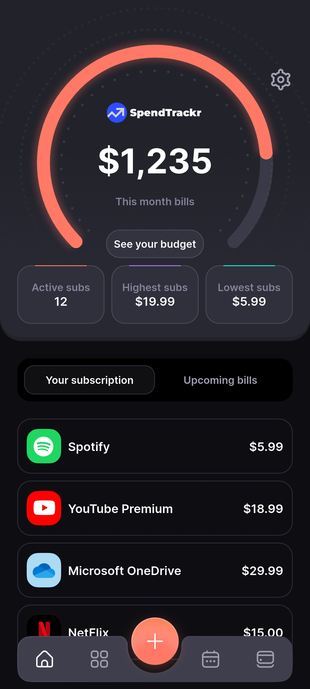
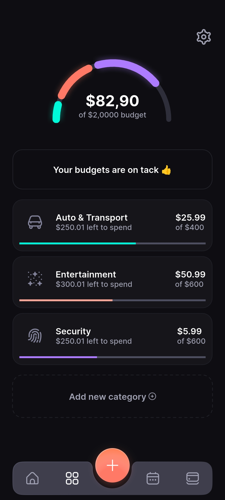
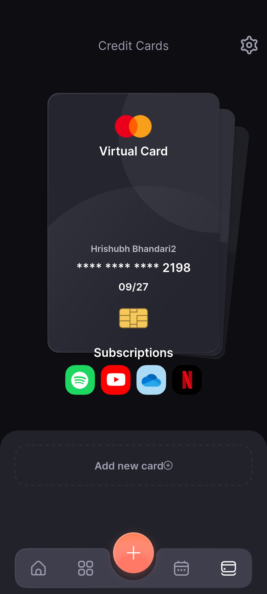
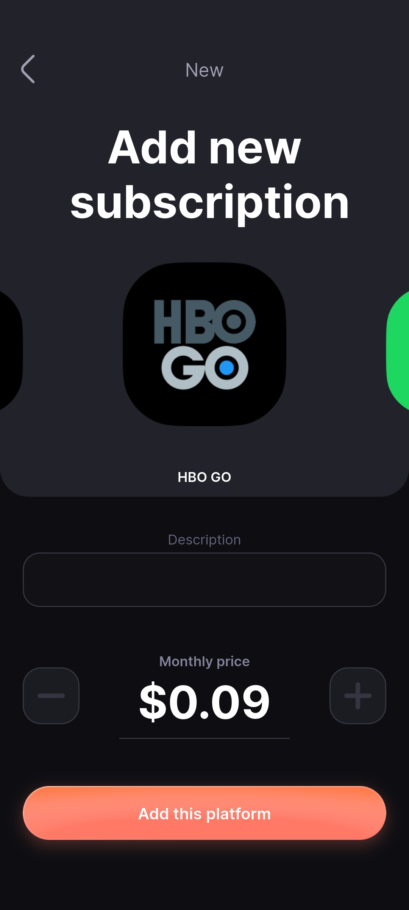
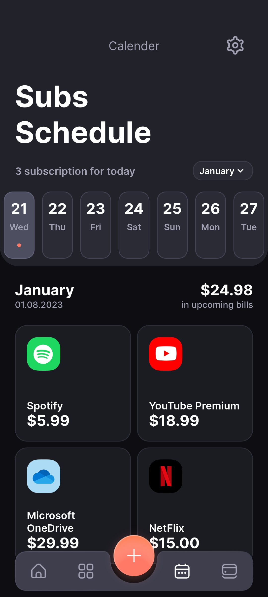
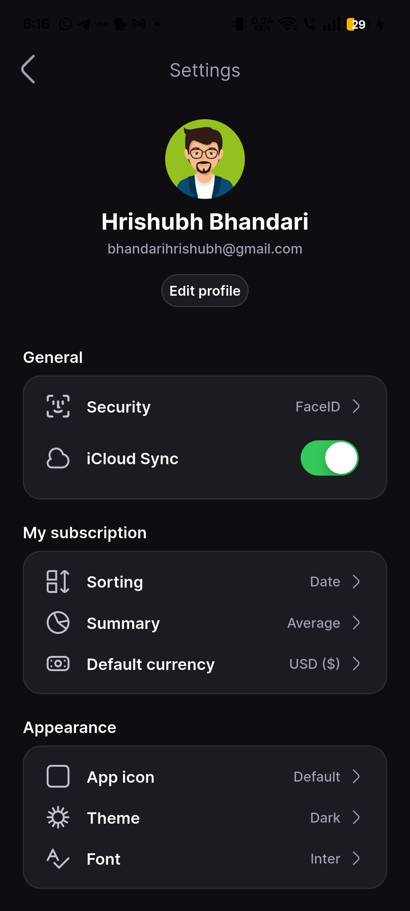

# 💸 SpendTrackr: Monthly Expenses Tracker

> **A beautifully designed Flutter app to track, analyze, and manage your monthly expenses, subscriptions, and budgets with ease.**


## 📋 Table of Contents

- [Overview](#-overview)
- [Key Features](#-key-features)
- [Technology Stack](#-technology-stack)
- [Architecture](#-architecture)
- [Installation](#-installation)
- [Usage](#-usage)
- [Screenshots](#-screenshots)
- [Performance Optimizations](#-performance-optimizations)
- [Contributing](#-contributing)
- [License](#-license)
- [Acknowledgments](#-acknowledgments)
- [Contact](#-contact)

---

## 🎯 Overview

**SpendTrackr** is a cross-platform mobile app built with Flutter, designed to help users effortlessly track their monthly expenses, manage subscriptions, and set spending budgets. With a clean UI, insightful analytics, and robust features, SpendTrackr empowers users to take control of their finances.

### What Makes SpendTrackr Special

- **All-in-One Finance Management**: Track expenses, manage recurring subscriptions, and set monthly budgets in one place.
- **Beautiful UI/UX**: Modern, intuitive, and responsive design for a delightful user experience.
- **Insightful Analytics**: Visualize spending patterns with charts and summaries.
- **Cross-Platform**: Runs seamlessly on both Android and iOS devices.

---

## ✨ Key Features

### 📊 **Expense Tracking**
- Add, edit, and delete expenses with categories and notes
- View monthly, weekly, and daily breakdowns
- Filter and sort transactions

### 🔔 **Subscription Management**
- Track recurring subscriptions (Netflix, Spotify, etc.)
- Get reminders for upcoming bills
- Visualize total monthly subscription costs

### 💰 **Budgeting**
- Set monthly spending limits by category
- Monitor progress and receive alerts when nearing limits

### 📅 **Calendar Integration**
- Calendar view for all expenses and bills
- Agenda-style overview of upcoming payments

### 📈 **Analytics & Insights**
- Pie and bar charts for spending analysis
- Category-wise breakdowns
- Trends and historical data

### 🛡️ **Secure & Private**
- All data stored locally on device (no cloud required)
- Optional biometric authentication (Face ID, Touch ID)

---

## 🛠 Technology Stack

- **Flutter 3.19.6** - Cross-platform UI toolkit
- **Dart 3.4.3** - Programming language for Flutter
- **Provider** - State management
- **SQLite** - Local data storage
- **Charts/Graph Libraries** - Data visualization
- **Custom Widgets** - For reusable UI components

---

## 🏗 Architecture

The app follows a modular, maintainable architecture:

```
┌────────────────────┐
│    Presentation    │
│  (Flutter Widgets) │
└─────────┬──────────┘
          │
┌─────────▼──────────┐
│   State Management │
│     (Provider)     │
└─────────┬──────────┘
          │
┌─────────▼──────────┐
│   Data Layer       │
│ (SQLite, Models)   │
└────────────────────┘
```

- **Presentation**: All UI screens and widgets
- **State Management**: Handles app state and business logic
- **Data Layer**: Local database and data models

---

## 🚀 Installation

### Prerequisites

- [Flutter SDK](https://flutter.dev/docs/get-started/install)
- Android Studio or Xcode (for emulators/simulators)
- A device or emulator

### Setup Instructions

1. **Clone the repository**
   ```bash
   git clone https://github.com/your-username/spendtrackr.git
   cd spendtrackr_monthly_expenses_tracker
   ```

2. **Install dependencies**
   ```bash
   flutter pub get
   ```

3. **Run the app**
   ```bash
   flutter run
   ```

4. **Build for release**
   - Android:
     ```bash
     flutter build apk
     ```
   - iOS:
     ```bash
     flutter build ios
     ```

---

## 📖 Usage

1. **Add Expenses**: Tap the "+" button to add a new expense, select a category, enter the amount, and save.
2. **Manage Subscriptions**: Go to the Subscriptions tab to add or edit recurring payments.
3. **Set Budgets**: Navigate to Budgets, set monthly limits, and track your progress.
4. **View Analytics**: Explore the Analytics tab for charts and spending insights.
5. **Calendar View**: Check the calendar for upcoming bills and past expenses.

---

## 🖼 Screenshots

Below are screenshots demonstrating the main features and UI of SpendTrackr:

### Dashboard
<div align="center">
  
  <br/>
  <em>Comprehensive overview of your monthly spending, budgets, and quick actions.</em>
</div>

---

### My Budget
<div align="center">
  
  <br/>
  <em>Track your budgets and monitor your spending progress by category.</em>
</div>

---

### Card Details
<div align="center">
  
  <br/>
  <em>View detailed information about your cards and transactions.</em>
</div>

---

### Add Subscription
<div align="center">
  
  <br/>
  <em>Easily add and manage recurring subscriptions.</em>
</div>

---

### Subscription Schedule
<div align="center">
  
  <br/>
  <em>See upcoming subscription payments and their schedules.</em>
</div>

---

### Settings
<div align="center">
  
  <br/>
  <em>Customize your app experience and manage preferences.</em>
</div>

---

## ⚡ Performance Optimizations

- **Efficient State Management**: Uses Provider for minimal rebuilds and smooth UI.
- **Lazy Loading**: Loads data and images only when needed.
- **Optimized Database Queries**: Fast and efficient local storage with SQLite.
- **Responsive Design**: Adapts to all screen sizes and orientations.

---

## 🤝 Contributing

We welcome contributions! Please follow these steps:

1. **Fork the repository**
2. **Create a feature branch** (`git checkout -b feature/amazing-feature`)
3. **Commit your changes** (`git commit -m 'Add amazing feature'`)
4. **Push to the branch** (`git push origin feature/amazing-feature`)
5. **Open a Pull Request**

### Development Guidelines

- Follow the existing code style
- Add tests for new features
- Update documentation as needed
- Ensure all tests pass before submitting

---

## 📄 License

This project is licensed under the MIT License - see the [LICENSE](LICENSE) file for details.

---

## 🙏 Acknowledgments

- **Flutter** - For the amazing cross-platform framework
- **Dart** - For powering the app logic
- **Open Source Libraries** - For community-driven packages and inspiration

---

## 📞 Contact

- **GitHub**: [@Hrishubh](https://github.com/Hrishubh)
- **LinkedIn**: [Hrishubh Bhandari](https://www.linkedin.com/in/hrishubh-bhandari/)
- **Email**: bhandarihrishubh@gmail.com

---

<div align="center">

**⭐ Star this repository if you found it helpful!**

Made with ❤️ by Hrishubh Bhandari

</div> 
